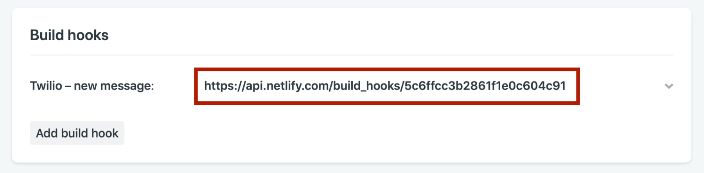
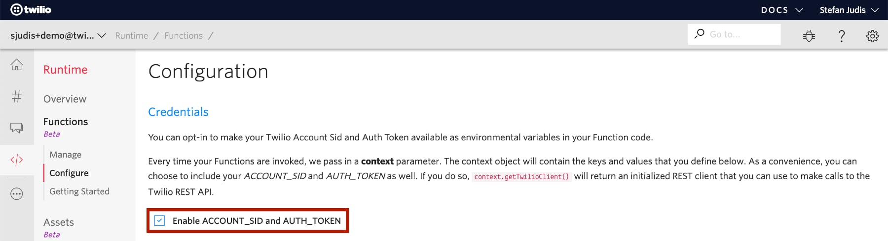

# How to set up grandma's gallery

You can set this project up in just a few minutes using Netlify's deploy button. **But you still have to configure Netlify and Twilio to communicate properly with each other.** Make sure to follow the instructions below.

## Ready? Let's deploy grandma's gallery

### Get configuration data from Twilio

### Deploy the site

Will ask for github permissions.

(👆 yes - press it!)

### Define the webhook to trigger rebuilds

Overview > Site Settings > Build & Deploy > Continuous Deployment > Build hooks

### Create serverless function and trigger netlify build

Copy the code from [here](...) and paste it to the new function.

### And that's it!

As your running now with a sandbox you have to register it!
